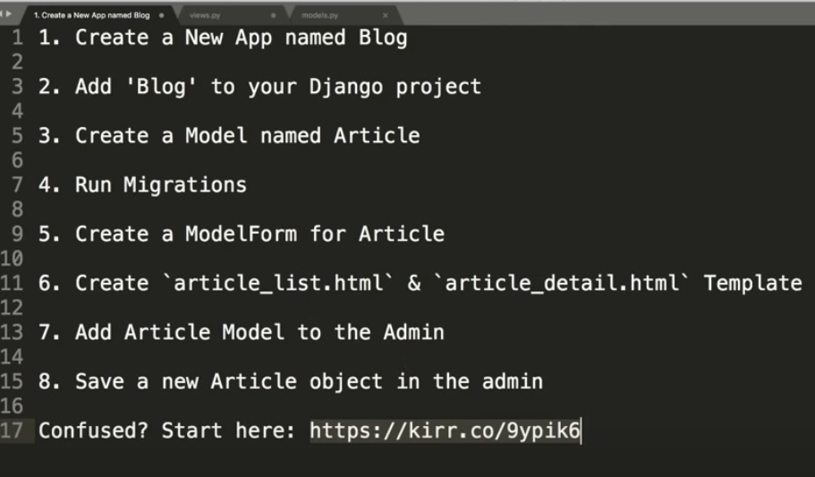

- [Preface](#preface)
- [Installing to Get Started](#installing-to-get-started)
- [Setup your Virtual Environment for Django](#setup-your-virtual-environment-for-django)
- [Create a Blank Django Project](#create-a-blank-django-project)
- [Setup Your Code Text Editor](#setup-your-code-text-editor)
- [Settings](#settings)
- [Built-In Components](#built-in-components)
- [Your First App Component](#your-first-app-component)
- [Create Product Objects in the Python Shell](#create-product-objects-in-the-python-shell)
- [New Model Fields](#new-model-fields)
- [Change a Model](#change-a-model)
- [Default Homepage to Custom Homepage](#default-homepage-to-custom-homepage)
- [URL Routing and Requests](#url-routing-and-requests)
- [Django Templates and Django Templating Engine Basics](#django-templates-and-django-templating-engine-basics)
- [Include Template Tag and Rendering Context in a Template](#include-template-tag-and-rendering-context-in-a-template)
- [For Loop in a Template and Using Conditions in a Template](#for-loop-in-a-template-and-using-conditions-in-a-template)
- [Render Data from the Database with a Model](#render-data-from-the-database-with-a-model)
- [How Django Templates Load with Apps](#how-django-templates-load-with-apps)
- [Django Model Forms](#django-model-forms)
- [Raw HTML Form and Pure Django Form](#raw-html-form-and-pure-django-form)
- [Form Widgets](#form-widgets)
- [Form Validation Methods](#form-validation-methods)
- [Initial Values for Forms](#initial-values-for-forms)
- [Dynamic URL Routing](#dynamic-url-routing)
- [Handle DoesNotExist](#handle-doesnotexist)
- [Delete and Confirm](#delete-and-confirm)
- [View of a List of Database Objects](#view-of-a-list-of-database-objects)
- [Dynamic Linking of URLs](#dynamic-linking-of-urls)
- [Django URLs Reverse](#django-urls-reverse)
- [In App URLs and Namespacing](#in-app-urls-and-namespacing)
- [Class Based Views - ListView DetailView CreateView and UpdateView DeleteView](#class-based-views---listview-detailview-createview-and-updateview-deleteview)
- [Function Based View to Class Based View](#function-based-view-to-class-based-view)
- [Raw Detail Raw List Raw Create Raw Update And Raw Delete Class Based View](#raw-detail-raw-list-raw-create-raw-update-and-raw-delete-class-based-view)
- [Form Validation on a Post Method](#form-validation-on-a-post-method)
- [Custom Mixin for Class Based Views](#custom-mixin-for-class-based-views)
- [Various Notes](#various-notes)

## Preface
I am studying a basic Django course on YouTube, and the course link is https://www.youtube.com/watch?v=F5mRW0jo-U4&t=375s. This GitHub repository contains the code I have written while learning the course, and the notes are written after I completed the course. The purpose of this repository is twofold: first, to document the key points of the course, and second, to provide notes to friends who are also learning the course so that they can learn quickly.
## Installing to Get Started
Check if Python is installed and install Django.
Relevant commands:
```bash
python --version
```
```bash
pip install django
```
```bash
django-admin --version
```
```bash
pip freeze 
```
## Setup your Virtual Environment for Django
~~~
Benefits of virtual environments:
1) Environment Isolation: Each virtual environment is independent, with its own Python version and a set of installed packages. This means you can use different versions of Django or other dependencies in different projects without conflicts.
2) Dependency Management: Virtual environments make it easier to manage a project's dependencies. You can create a `requirements.txt` file for each project, listing all the required packages, making it easy to reproduce the same setup in different environments.
3) Simplified Deployment: Using virtual environments can simplify the deployment process of your applications because you can ensure that the packages in the production environment are identical to those in the development and testing environments.
4) Protecting the System Environment: Virtual environments prevent adding packages to the global Python installation, which can prevent potential system-level conflicts and keep the system clean.
5) Experimentation and Testing: Virtual environments make it very easy to switch between different versions of packages, which is especially useful for experimenting and testing new features.
~~~
- In the command line, navigate to your project directory (or create a new directory).
- Run the following command to create and enter a virtual environment:
```bash
python3 -m venv myenv
```
- for macOS/Linux:
```bash
source myenv/bin/activate
```
## Create a Blank Django Project
Open the terminal or command prompt, and then run the following command (where "myproject" is your project name, which you can change as needed):
```bash
django-admin startproject myproject
```
After running the above command, you will get the following file structure:
~~~
myproject/
    manage.py
    myproject/
        __init__.py
        settings.py
        urls.py
        asgi.py
        wsgi.py
~~~
These files and directories serve the following purposes:
- <p>manage.py: A command-line tool for interacting with this Django project.</p>
- <p>myproject/: The main directory for your project.</p>
- <p>__init__.py: An empty file that tells Python this directory should be considered a Python package.</p>
- <p>settings.py: Project settings/configuration.</p>
- <p>urls.py: URL declarations for the project; acts as the "directory" for your website.</p>
- <p>asgi.py: Provides a hook for running your project as an ASGI application.</p>
- <p>wsgi.py: Provides a hook for running your project as a WSGI application.</p>
## Setup Your Code Text Editor
You can choose an editor like VSCode or Sublime Text, among others, based on your personal preference.
## Settings
Django can run on different operating systems (Windows, Mac, Linux), and these systems can use the same Django settings.
~~~
1）Base directory (__BASE_DIR__):
The BASE_DIR variable is set to a string pointing to the directory where the manage.py file is located, typically the project's root directory. This is crucial for relative path settings within the project.
2）Secret key (__SECRET_KEY__):
Every Django project has a unique SECRET_KEY used for security and encryption. In production, this key should remain private and not be disclosed.
3）Debug mode (__DEBUG__):
The DEBUG setting is very useful during development as it provides detailed error reports. In a production environment, it should be set to False.
4）Allowed hosts (__ALLOWED_HOSTS__):
This setting defines which domain names can access your Django application.
5）Installed applications (__INSTALLED_APPS__):
INSTALLED_APPS contains all the Django applications used in the project. This is a core concept in Django for adding and managing different components of the project.
6）Middleware (__MIDDLEWARE__):
Middleware is used for handling requests and responses, as well as managing security and other features. It's a slightly more advanced topic that often involves request processing and security features.
7）Root URL configuration (__ROOT_URLCONF__):
This setting defines how Django routes different URLs to their corresponding view functions.
8）Templates (__TEMPLATES__):
The instructor mentioned how Django renders HTML templates, including the storage location and rendering process of templates.
9）WSGI application (__WSGI_APPLICATION__):
This setting defines how Django interfaces with the web server to handle application requests.
~~~
## Built-In Components
I forgot what the video covered in this section, so I did some research and learned about the relevant content from other sources.
Below is a summary of ChatGPT's built-in components：
~~~
Django 是一个高度组件化的框架，提供了许多内置组件（也称为 "apps"），以便快速开发网站。以下是一些核心的内置组件及其功能：
1. Admin
Django 自带一个强大的管理后台，允许管理员通过网页直接管理数据库内容。你只需要定义你的模型，Django 就能自动生成管理界面。它是一个非常强大的工具，可以用来执行 CRUD（创建、读取、更新、删除）操作。
2. Authentication
Django 的认证系统提供了用户认证的功能，包括用户账号、组、权限和会话（sessions）管理。它也支持密码哈希和自定义用户模型。
3. ORM (Object-Relational Mapping)
Django 的 ORM 允许你使用 Python 代码来操作数据库，而不是直接写 SQL 语句。它支持多种数据库系统，并且可以通过简单的命令进行数据库迁移。
4. Forms
Django 的表单功能提供了一种生成和处理 HTML 表单的机制，包括表单验证、自动化的表单呈现以及安全性措施，如防止跨站请求伪造（CSRF）。
5. Views
在 Django 中，视图函数或类处理用户的请求并返回响应。Django 提供了基于函数的视图（FBV）和基于类的视图（CBV），以便根据不同需求选择使用。
6. URL Dispatcher
URL 分发器允许你设计优雅的 URL 模式。请求到达 Django 服务器时，它是由 URL 分发器处理的，然后映射到相应的视图进行处理。
7. Template Engine
Django 附带了自己的模板系统，允许你创建动态生成的 HTML 页面。它支持模板继承和重用，简化了页面的编写。
8. Middleware
中间件是在请求和响应之间运行的钩子系统，可以用于处理视图之前或之后的流程，如添加 CORS headers、开启 session 管理等。
9. Internationalization and Localization
Django 支持多语言和本地化，这意味着你可以创建可以根据用户的语言偏好来展示的网站。
10. Static Files Management
Django 管理静态文件（如 CSS、JavaScript 和图片），并提供了集成的方法来处理它们。
11. Testing Framework
Django 内置了一个测试框架，用于编写和执行测试，以确保你的应用可以按照预期工作。
12. Signals
信号允许某些发送者通知一组接收者发生了某个动作。这是实现解耦的好方法。
这些组件共同构成了 Django 的强大基础，使得开发者可以专注于构建特定的功能，而不是重新发明轮子。它们都经过精心设计，旨在让 Web 开发更快、更安全、更容易。
~~~
http://127.0.0.1:8000/admin/
The above URL is accessible directly.
## Your First App Component
#### 1.Create a New Application
Open your terminal or command prompt and navigate to the Django project directory that contains the manage.py file. Run the following command to create a new application, where myapp is your application name:
```bash
python manage.py startapp myapp
```
This command will create a new directory called myapp within your Django project directory and generate some basic file structures within that directory.
#### 2.Application Structure
The directory structure for the new application will include the following files:
~~~
1）migrations/: Directory containing database migration files.
2）__init__.py: An empty file indicating that this directory should be treated as a Python package.
3）admin.py: Used for registering models so they can be managed in the Django admin panel.
4）apps.py: The application's configuration file.
5）models.py: Where you'll define the application's database models.
6）tests.py: Where you can write tests for your application.
7）views.py: Where you can define views or view classes for your application.
~~~
#### 3.Add the Application to the Project
After creating the application, you need to add it to the project's settings.py file so that Django is aware of the application. In the settings.py file, locate the INSTALLED_APPS configuration and add the configuration class for your application. Typically, you can add the name of your application directly:
```python
INSTALLED_APPS = [
    # ... other installed apps ...
    'myapp',  # Add your app here
]
```
#### 4.Start Using the Application
Now you can start defining models in models.py, creating views in views.py, writing templates, and handling forms, among other things. Each Django application should be self-contained, meaning it should include everything necessary to implement a specific functionality, including models, views, templates, static files, and more.
#### 5.Migrate Your Application
If you have defined models in models.py, you'll need to create and apply migrations to update the database:
```bash
python manage.py makemigrations myapp
python manage.py migrate
```
This will generate new migration files and update the database to match your models.
#### 6.summary
By following these steps, you can create a Django application, which is the basic unit for organizing and developing functionality within a Django project. Each application should handle a specific functional area and should be loosely coupled with other applications.
## Create Product Objects in the Python Shell
#### Step 1: Define Your Model
Firstly, ensure you have a model defined in your models.py file within the relevant application. For example, a simple Product model might look like this:
```python
from django.db import models
class Product(models.Model):
    name = models.CharField(max_length=100)
    description = models.TextField()
    price = models.DecimalField(max_digits=10, decimal_places=2)
    in_stock = models.BooleanField(default=True)
```
#### Step 2: Run Migrations
```bash
python manage.py makemigrations
python manage.py migrate
```
#### Step 3: Open the Django Shell
You can open the Django shell with the following command:
```bash
python manage.py shell
```
#### Step 4: Import Your Model
In the shell, import the model you wish to create objects for:
```python
from myapp.models import Product
```
Replace myapp with the name of the Django app containing your Product model.
#### Step 5: Create Product Objects
Now, you can create instances of the Product model:
```python
# Create a new product instance
new_product = Product(name='Example Product', description='This is an example product.', price=9.99, in_stock=True)
# Save the object to the database
new_product.save()
```
Alternatively, you can use the create() method on the model's manager to create and save an object in one step:
```python
new_product = Product.objects.create(name='Another Product', description='Another example product.', price=14.99, in_stock=True)
```
#### Step 6: Verify the Creation
You can check if the object was created by querying the database:
```python
# Get all products
all_products = Product.objects.all()
print(all_products)
# Get a single product
product = Product.objects.get(name='Example Product')
print(product.description)
```
#### Step 7: Exit the Shell
When you're done, you can exit the shell by simply typing:
```python
exit()
```
Or by pressing Ctrl+D on Linux/Mac or Ctrl+Z followed by Enter on Windows.
## New Model Fields
"New Model Fields" in the context of Django refers to adding additional fields to your existing Django models. This is a common operation when you need to store new information in your database tables or when extending the functionality of your existing Django app.
#### Step 1: Modify Your Model
Open the models.py file within your Django app and add new field definitions to your model class. For example:
```python
from django.db import models
class Product(models.Model):
    name = models.CharField(max_length=100)
    # Existing fields...
    # Add a new field
    category = models.CharField(max_length=100)
```
In this example, category is the new field added to the Product model.
#### Step 2: Create Migrations
After modifying the model, you need to create a new migration to reflect these changes in the database schema. Run the makemigrations command:
```bash
python manage.py makemigrations
```
Django will automatically generate a migration file for the changes.
#### Step 3: Apply Migrations
Apply the migration to update the database schema with the migrate command:
```bash
python manage.py migrate
```
This will alter your database table by adding the new category column.

#### Step 4: Update Your Forms, Serializers, and Templates
If you have any forms, serializers, or templates that interact with the modified model, update them to include the new fields where necessary.
For forms in forms.py:
```python
from django import forms
from .models import Product
class ProductForm(forms.ModelForm):
    class Meta:
        model = Product
        fields = ['name', 'category']  # Include the new field
```
#### Step 5: Update Admin Interface (Optional)
If you are using the Django admin interface and wish to manage the new field through it, update admin.py to include the new field in the list display, fieldsets, etc.
```python
from django.contrib import admin
from .models import Product
@admin.register(Product)
class ProductAdmin(admin.ModelAdmin):
    list_display = ['name', 'category']  # Include the new field
```
#### Step 6: Modify Views and Templates (Optional)
Modify any views and templates that should include the new field. For instance, you might need to display the new field's value in templates or handle it in view logic.
#### Things to Consider
When adding new fields, consider whether they need to be __nullable__ (null=True) or have __default__ __values__ (default=<value>), especially if you're adding fields to a table that already has data.
If the new field must not be empty, you will either need to set a default value or provide a value for existing rows during the migration process.
Be aware of the implications of altering the database schema on your production data. It's good practice to backup your database before applying migrations that modify the database schema.
## Change a Model
Similar to the "New Model Fields" above.
## Default Homepage to Custom Homepage
Changing the default homepage to a custom homepage in Django involves a few steps where you'll define a new view for the homepage, create a corresponding template, and then configure the URL patterns to point to this new view. Here's how you do it:
#### Step 1: Create a View for Your Homepage
Open the views.py file in your Django app and define a new view function or class. Here’s an example using a function-based view:
```python
from django.shortcuts import render
def home_page_view(request):
    return render(request, 'home.html')
```
#### Step 2: Create a Template for the Homepage
Create a new HTML file for your homepage template. You might place it in your templates directory, which could look like yourapp/templates/home.html.
Here's a simple example of what home.html might contain:
```html
<!DOCTYPE html>
<html lang="en">
<head>
    <meta charset="UTF-8">
    <title>My Custom Homepage</title>
</head>
<body>
    <h1>Welcome to My Website!</h1>
    <p>This is a custom homepage.</p>
</body>
</html>
```
#### Step 3: Configure the URL Patterns
In your project's urls.py file, import the view you created and set it as the view for the root URL pattern.
```python
from django.urls import path
from yourapp.views import home_page_view  # Import the view
urlpatterns = [
    path('', home_page_view, name='home'),  # Set the root URL
    # ... other url patterns ...
]
```
replace yourapp with the actual name of your Django app.

#### Step 4: Test Your New Homepage
Run your development server with:
```bash
python manage.py runserver
```
Now when you go to http://127.0.0.1:8000/ in your web browser, you should see your new custom homepage instead of the default Django welcome page.
#### Additional Notes:
- If you're using class-based views, the process is similar but you would define a class inheriting(继承) from django.views.generic.TemplateView or another appropriate base class.
- Ensure that your templates directory is correctly set up in your settings. It should be automatically configured if you're using the startapp command to create your app.
- If you have static files (like CSS, JavaScript, or images) that you want to include in your homepage, make sure to set up static files handling in your Django settings.
- Consider using a base template to define the common structure of your website and extend it using the ____ template tag in home.html. This helps keep your templates organized and easier to maintain.
## URL Routing and Requests
URL routing and handling requests are fundamental aspects of a web framework. 
#### URL Routing in Django
__Django uses a urls.py file, also known as a URLconf (URL configuration), to map URLs to views.__ A view is __a Python function or class__ that takes a web request and returns a web response. This mapping tells Django what logic to execute for a given URL pattern.
###### Defining URL Patterns
In your urls.py file, you will typically see patterns defined like this:
```python
from django.urls import path
from . import views
urlpatterns = [
    path('admin/', admin.site.urls),
    path('about/', views.about, name='about'),
    path('products/<int:product_id>/', views.product_detail, name='product_detail'),
    # ... other patterns ...
]
```
In this example, there are a few URL patterns defined:
- The first pattern routes to Django's admin interface.
- The second pattern routes requests for the /about/ URL to a view named about in the views.py file.
- The third pattern is a dynamic URL that captures a product ID from the URL and passes it to a view named product_detail.
###### Dynamic URL Patterns
<p>Django can handle dynamic URL routing using path converters. For example, in the pattern products/< int:product_id >/, < int:product_id > is a path converter that matches one or more digits and passes them as an integer to the view function.</p>

## Django Templates and Django Templating Engine Basics
Django templates are a key component of the Django web framework, allowing for a separation between the presentation layer (HTML/CSS) and the business logic (Python code). Django's templating engine provides a powerful way to control how data is displayed.
#### Django Templates
A Django template is a text file defining the structure or layout of a file (like an HTML page), with placeholders used to represent actual content. These placeholders are represented by template tags and variables.
- Variables: Use {{ variable_name }} to include Python variables passed from the view into the template. For example, {{ user.name }} would be replaced with the name attribute of the user context variable.
- Tags: Use  for logic and control flow, such as loops or if-else statements. For instance,  would loop over each product in the product_list.
- Filters: Use {{ variable|filter }} for formatting variables. Filters transform the display of a variable, such as converting a string to uppercase with {{ name|upper }}.
- Comments: Use {# #} to add comments in your templates that will not be rendered to the user.
Here's an example of a simple Django template:
```html
<!DOCTYPE html>
<html lang="en">
<head>
    <meta charset="UTF-8">
    <title>Product List</title>
</head>
<body>
    <h1>Products</h1>
    
        <ul>
        
            <li>{{ product.name }} - ${{ product.price }}</li>
        
        </ul>
    
        <p>No products available.</p>
    
</body>
</html>
```
#### Django Templating Engine
The Django templating engine is responsible for parsing the template and rendering it into HTML. It does this by combining the template with a context dictionary and processing the tags, variables, and filters.
#### Using Templates in Views
To use a template in a view, you typically import the render function and use it to generate an HttpResponse object with the rendered text:
```python
from django.shortcuts import render
def product_list(request):
    products = Product.objects.all()
    return render(request, 'product_list.html', {'product_list': products})
```
The render function takes three arguments:
- request: The original HTTP request.
- template_name: The path to the template file.
- context: A dictionary of data to pass to the template.
#### Template Inheritance
One of the most powerful features of Django templates is inheritance. You can define a base "skeleton" template that contains all the common elements of your site and define blocks that child templates can override.
Base template (base.html):
```html
<!DOCTYPE html>
<html lang="en">
<head>
    
    <meta charset="UTF-8">
    <title>My Site</title>
    
</head>
<body>
    
    
</body>
</html>
```
#### Child template (product_list.html):
```html


Product List


<h1>Products</h1>
<!-- Content goes here -->

```
#### Configuration
The Django templating engine needs to be configured in the settings.py file of your project. By default, Django is already set up to use its templating engine, but you can customize various options like directories where templates are stored, template context processors, etc.
This system allows for the creation of dynamic, data-driven websites with complex layouts and formatting, without mixing Python code into the HTML content, promoting a clean separation of concerns.
## Include Template Tag and Rendering Context in a Template
The ____ tag allows you to include one template inside another. This is particularly useful for reusing common parts of your HTML, like headers, footers, or navigation bars, across different pages of your website.
For example, if you have a navigation bar defined in a file named _navbar.html, you can include it in other templates like this:
```html
<body>
    
    <!-- The rest of your body content goes here -->
</body>
```
When you use the ____ tag, the included template has access to the variables of the parent template's context.

The context in Django templates refers to the variables passed from the view to the template. Each variable can be rendered in the template using the double curly braces __{{ }}__.

For example, if your view looks like this:
```python
def my_view(request):
    context = {'user': request.user, 'email': 'user@example.com'}
    return render(request, 'my_template.html', context)
```
In my_template.html, you can render the context variables like this:
```html
<p>Username: {{ user.username }}</p>
<p>Email: {{ email }}</p>
```
##### Advanced Usage of Context !!!!!!
You can also use dot notation to access properties of context variables, and you can call methods on them (as long as the methods do not require any arguments).
For example, if a user object has a method get_full_name, you could use it in your template like this:
```html
<p>Full name: {{ user.get_full_name }}</p>
```
##### Using Filters to Modify Context Variables
Django's template filters allow you to modify the display of variables. Filters are applied using the __|__ character and can be chained together.
For instance, if you want to display the email in uppercase, you could use the upper filter:
```html
<p>Email: {{ email|upper }}</p>
```
Filters can also take arguments. For example, the date filter formats Python datetime objects. You can use it like this:
```html
<p>Joined date: {{ user.date_joined|date:"Y-m-d" }}</p>
```
##### Template Inheritance
Context variables are also available in child templates that inherit from a parent template using the ____ tag. This is a cornerstone of DRY (Don't Repeat Yourself) principles in Django template design.

By using the ____ tag and rendering context in templates, you can create a dynamic and maintainable structure for your Django application's frontend, ensuring that the Python code used to generate context data is kept separate from the HTML markup.

## For Loop in a Template and Using Conditions in a Template
The ____ template tag allows you to iterate over a sequence (like a list or queryset) and render a block of HTML for each item in the sequence. Here’s an example:
```python
def my_view(request):
    context = {'products': Product.objects.all()}
    return render(request, 'my_template.html', context)
```
In my_template.html, you can iterate over this list:
```html
<ul>
    
        <li>{{ product.name }} - ${{ product.price }}</li>
    
</ul>
```
Django templates also support conditional statements using ____, ____, and ____. You can use these to render different HTML based on certain conditions. For example:
```html

    <p>Welcome, {{ user.username }}!</p>

    <p>Welcome, Guest!</p>

```
## Render Data from the Database with a Model
Similar to the contents above. The difference is that you need to register the model. For example:(in admin.py)
```python
from django.contrib import admin
from .models import Post

admin.site.register(Post)
```
## How Django Templates Load with Apps
When you create a Django app, it’s common practice to create a templates directory within your app's directory. Django looks for templates in each app's "templates" directory by default.
For example, if you have an app called blog, the recommended structure would look like this:
~~~
blog/
    ...
    templates/
        blog/
            index.html
            detail.html
            ...
~~~
Here, index.html and detail.html are templates specific to the blog app.
#### Namespacing Template Names
namespace your templates by placing them in a subdirectory within your app's templates directory named after the app. 

This prevents template name collisions between apps. 

For example, blog/templates/blog/index.html rather than just blog/templates/index.html.

#### Loading Templates in Views
When rendering a template in a view, you refer to it by its path, relative to the templates directory of any app. For example:
```python
return render(request, 'blog/index.html', context)
```
#### Template Inheritance
A common pattern in Django is to have a base template that contains the common structure of your site (like a base.html), and then other templates extend this base template. This base template can be placed in a project-wide templates directory, which is usually specified in the __TEMPLATES__ setting in settings.py.
#### Configuration in settings.py
The TEMPLATES setting in settings.py allows you to configure how Django finds and loads templates. The default DIRS option is empty, which tells Django to only search within the templates directories of each installed app. You can add other directories to this setting:
```python
TEMPLATES = [
    {
        ...
        'DIRS': [os.path.join(BASE_DIR, 'templates')],
        ...
    },
]
```
#### App Order Matters
The order of apps in INSTALLED_APPS can affect template loading. Django searches for templates in the order the apps are listed. So, if two apps have a template with the same name and relative path, Django will use the first one it finds.

## Django Model Forms
#### Step 1: Define a Model
First, ensure you have a model defined in your models.py. For example:
```python
from django.db import models

class Book(models.Model):
    title = models.CharField(max_length=200)
    author = models.CharField(max_length=100)
    published_date = models.DateField()
```
#### Step 2: Create a Model Form
Create a model form in your forms.py file by subclassing django.forms.ModelForm and specifying which model to use.
```python
from django import forms
from .models import Book

class BookForm(forms.ModelForm):
    class Meta:
        model = Book
        fields = ['title', 'author', 'published_date']  # You can also use '__all__' to include all fields
```
#### Step 3: Use the Form in a View
In your view, you can instantiate a form instance with a model instance to edit, or none to create a new one.
```python
from django.shortcuts import render, redirect
from .forms import BookForm

def book_create_view(request):
    if request.method == 'POST':
        form = BookForm(request.POST)
        if form.is_valid():
            form.save()
            return redirect('book-list')  # Redirect to the book list or detail view
    else:
        form = BookForm()

    return render(request, 'books/book_form.html', {'form': form})
```
#### Step 4: Create a Template
Create a template to display the form. Django forms can auto-generate form fields, which makes rendering in templates straightforward.
```html
<form method="post">
    
    {{ form.as_p }}
    <button type="submit">Submit</button>
</form>
```
#### Step 5: Handling Errors
Model forms also handle form validation. If the form is not valid, it will populate the form.errors dictionary, which you can display in your template.

## Raw HTML Form and Pure Django Form
#### Raw HTML Form
A raw HTML form is a straightforward way to create a form using standard HTML form elements. This method gives you complete control over the form's appearance and structure, but requires more manual setup for handling form submissions and validation.
Example
In your template (some_template.html), you would write the HTML form directly:
```html
<form method="post" action="/your-form-handler-url/">
    
    <label for="title">Title:</label>
    <input type="text" id="title" name="title">

    <label for="content">Content:</label>
    <textarea id="content" name="content"></textarea>

    <button type="submit">Submit</button>
</form>
```
In your view, you handle the form submission manually:
```python
from django.http import HttpResponseRedirect
from django.shortcuts import render

def form_handler_view(request):
    if request.method == 'POST':
        title = request.POST.get('title')
        content = request.POST.get('content')
        # Process the data, save it, etc...

        return HttpResponseRedirect('/success-url/')

    return render(request, 'some_template.html')
```
#### Pros and Cons
__Pros__: Full control over the form's HTML, useful for custom styling.
__Cons__: More manual work for validation, processing form data, and displaying errors.

#### Pure Django Form
Pure Django Forms involve using Django's built-in form classes. This method is more abstracted, handling much of the boilerplate code for creating forms, validating input, and rendering form fields.
__Example__:
First, define a Django form in forms.py:
```python
from django import forms

class MyForm(forms.Form):
    title = forms.CharField()
    content = forms.CharField(widget=forms.Textarea)
```

In your view, use this form class to handle form rendering, submission, and validation:
```python
from django.shortcuts import render
from .forms import MyForm

def form_view(request):
    if request.method == 'POST':
        form = MyForm(request.POST)
        if form.is_valid():
            # Process the data in form.cleaned_data
            return HttpResponseRedirect('/success-url/')
    else:
        form = MyForm()

    return render(request, 'form_template.html', {'form': form})
```

Then, in your template, render the form:
```html
<form method="post">
    
    {{ form.as_p }}
    <button type="submit">Submit</button>
</form>
```
#### Pros and Cons
__Pros__: Simplifies form creation, validation, and handling. Automatically generates form fields and handles CSRF protection.
__Cons__: Less control over the form's HTML markup. Custom styling may require more work.
#### Conclusion
__Raw HTML Form__: Offers maximum control over form markup but requires manual handling of form submissions and validation.
__Pure Django Form__: Provides a quicker, more abstracted way to handle forms, ideal for standard forms where Django’s default behaviors and styles are sufficient.

## Form Widgets
Widgets in Django are used to define HTML form elements. They determine how a field is rendered in the HTML and how the field's data is extracted from the HTTP request. Django provides a variety of built-in widgets for different input types like text, date, email, etc.

You can specify widgets in your forms to control the rendering of form fields. For instance, if you have a DateField and want to use a specific date picker widget, you would do so in your form definition.
```python
from django import forms

class MyForm(forms.Form):
    my_date = forms.DateField(widget=forms.widgets.DateInput(attrs={'type': 'date'}))
```
In this example, DateInput is the widget used for the my_date field, and attrs={'type': 'date'} sets the HTML5 date picker for that field.

## Form Validation Methods
Validation is a crucial part of handling forms in Django. It ensures that the submitted data is correct and safe. Django forms come with built-in validation for their fields, but you can also add custom validation methods.

#### Clean Method
You can override the clean() method of a form to perform custom validation that applies to multiple fields. It's a place where you can clean and manipulate the data after it has passed the individual field validation.
```python
class MyForm(forms.Form):
    # fields...

    def clean(self):
        cleaned_data = super().clean()
        field_one = cleaned_data.get("field_one")
        field_two = cleaned_data.get("field_two")

        if field_one and field_two:
            # Custom validation logic
            pass
```
#### Field-specific Clean Methods
For field-specific validation, you use clean_<fieldname>() methods. Here, you can include validation logic for individual fields.
```python
class MyForm(forms.Form):
    my_field = forms.CharField()

    def clean_my_field(self):
        data = self.cleaned_data['my_field']

        # Custom validation logic for my_field
        if not "django" in data:
            raise forms.ValidationError("Must include 'django'")

        return data
```
## Initial Values for Forms
set initial values when you instantiate your form. This is useful for providing default values:
```python
form = MyForm(initial={'field_name': 'Initial Value'})
```
#### Pre-populating a Form with Model Instance Data
For model forms, you can pre-populate a form with data from a model instance by passing the instance to the form:
```python
instance = MyModel.objects.get(id=1)
form = MyModelForm(instance=instance)
```
## Dynamic URL Routing
Dynamic URL routing in Django involves capturing values from the URL and passing them as arguments to your view functions or classes.
#### Path Converters
You use path converters in your URL patterns to specify the type of value you expect to capture. Here are some common converters:
~~~
1）int: Matches one or more digits and converts the value to an integer.
2）str: Matches any non-empty string excluding the path separator (/).
3）slug: Matches any slug string (letters, numbers, hyphens, or underscores).
4）uuid: Matches a formatted UUID.
~~~
Example of Dynamic URL Routing
In your urls.py:
```python
from django.urls import path
from . import views

urlpatterns = [
    path('article/<int:article_id>/', views.article_detail, name='article_detail'),
]
```
In this example, __article/< int:article_id >/__ captures an integer value and passes it to the article_detail view as article_id.
#### Handling Dynamic URLs in Views
In your views.py:
```python
from django.shortcuts import render, get_object_or_404
from .models import Article

def article_detail(request, article_id):
    article = get_object_or_404(Article, pk=article_id)
    return render(request, 'article_detail.html', {'article': article})
```
In this view function, article_id is used to retrieve a specific Article instance from the database.

## Handle DoesNotExist
The DoesNotExist exception is raised when a query to the database does not find any matching objects. It's important to handle this exception to avoid server errors when an object is not found.
```python
from django.shortcuts import render, get_object_or_404
from .models import MyModel
def my_view(request, id):
    try:
        obj = MyModel.objects.get(pk=id)
    except MyModel.DoesNotExist:
        # Handle the error, e.g., show a custom error page or redirect
        return render(request, 'not_found.html')
    return render(request, 'detail.html', {'object': obj})
```
Alternatively, you can use get_object_or_404() which encapsulates this try-except pattern:
```python
obj = get_object_or_404(MyModel, pk=id)
```
## Delete and Confirm
Had better have a confirmation step to prevent accidental deletions. This is typically implemented with two views: one to ask for confirmation and another to handle the actual deletion.
__Confirmation View__
Create a template that asks the user to confirm the deletion.
delete_confirm.html:
```html
<h1>Are you sure you want to delete this object?</h1>
<form method="post">
    
    <input type="submit" value="Confirm">
</form>
<a href="">Cancel</a>
```
__Delete View__
The view that processes the deletion:
```python
from django.http import HttpResponseRedirect
from django.urls import reverse

def delete_view(request, id):
    if request.method == 'POST':
        obj = get_object_or_404(MyModel, pk=id)
        obj.delete()
        return HttpResponseRedirect(reverse('object-list'))  # Redirect to the list view
    return render(request, 'delete_confirm.html')
```

## View of a List of Database Objects
Creating a view to display a list of objects from the database is a common requirement. Now we already are familiar with it.
```python
def list_view(request):
    objects = MyModel.objects.all()  # Retrieve all objects from the database
    return render(request, 'list_template.html', {'objects': objects})
```
In list_template.html, you can loop over the objects and display them:
```html
<h1>List of Objects</h1>
<ul>
    
        <li>{{ obj.field_name }}</li>  <!-- Replace 'field_name' with actual field names -->
    
        <li>No objects found.</li>
    
</ul>
```
## Dynamic Linking of URLs
In Django, dynamic linking of URLs, using the __reverse__ function, and namespacing URLs are key concepts for creating maintainable and scalable web applications.
#### Dynamic Linking of URLs
Dynamic linking refers to the creation of URLs based on the name of the view or the pattern of the URL. Instead of hardcoding URLs in your templates and views, you use Django's URL naming and reversing features. This makes your code more maintainable and less prone to errors, especially when URLs change.
__Example__
In your urls.py, you name your URL patterns:
```python
from django.urls import path
from . import views

urlpatterns = [
    path('articles/<int:article_id>/', views.article_detail, name='article-detail'),
]
```
In your templates, you can dynamically link to this URL:
```html
<a href="">Read Article</a>
```
tips: 
~~~
url: This is a specific template tag used to generate URLs. It takes a view name as a parameter and can accept any keyword arguments required by the view.
~~~
## Django URLs Reverse
The reverse function in Django is used to reverse-resolve URLs. It allows you to obtain a URL as a string from a view name or a named URL pattern. This is particularly useful in views and other Python code where you don't have the template's  tag available.
__Example__:
```python
from django.urls import reverse

url = reverse('article-detail', args=[article_id])
```
Or, if you're using keyword arguments:
```python
url = reverse('article-detail', kwargs={'article_id': article_id})
```
## In App URLs and Namespacing
When you have multiple apps in a Django project, namespacing your URLs helps to differentiate between URL names that might be the same across different apps.
#### Namespacing URLconf
In your app's urls.py, you can include an app_name to create a namespace:
```python
from django.urls import path
from . import views

app_name = 'myapp'

urlpatterns = [
    path('articles/<int:article_id>/', views.article_detail, name='article-detail'),
]
```
In your project's urls.py, include your app's URLs:
```python
from django.urls import include, path

urlpatterns = [
    path('myapp/', include('myapp.urls')),
]
```
Now, you can refer to the namespaced URL using the format namespace: name
```html
<a href="">Read Article</a>
```
Or in Python code:
```python
url = reverse('myapp:article-detail', args=[article_id])
```

## Class Based Views - ListView DetailView CreateView and UpdateView DeleteView
The code in the repository already does a good job of illustrating the content of this example.
To illustrate this better, let's go through another small example here.

Class-based views (CBVs) in Django provide a way to handle common web development patterns. Here’s an overview of some of the most used CBVs: ListView, DetailView, CreateView, UpdateView, and DeleteView.

#### ListView
ListView is used to display a list of objects. It's a simple way to render a list from a given model.
```python
from django.views.generic import ListView
from .models import MyModel

class MyModelListView(ListView):
    model = MyModel
    template_name = 'myapp/my_model_list.html'  # Specify your template name
    context_object_name = 'objects'  # The name of the context variable in the template (defaults to 'object_list' if not specified)
```
#### DetailView
DetailView is used for displaying detail of a single object. It requires a primary key or slug passed through the URL.
```python
from django.views.generic import DetailView
from .models import MyModel

class MyModelDetailView(DetailView):
    model = MyModel
    template_name = 'myapp/my_model_detail.html'  # Specify your template name
```
#### CreateView
CreateView is used to display a form for creating a new object and saving it to the database.
```python
from django.views.generic.edit import CreateView
from .models import MyModel
from .forms import MyModelForm

class MyModelCreateView(CreateView):
    model = MyModel
    form_class = MyModelForm
    template_name = 'myapp/my_model_form.html'  # Specify your template name
    success_url = '/success-url/'  # URL to redirect after successfully creating the object
```
#### UpdateView
UpdateView is similar to CreateView but is used for updating an existing object.
```python
from django.views.generic.edit import UpdateView
from .models import MyModel
from .forms import MyModelForm

class MyModelUpdateView(UpdateView):
    model = MyModel
    form_class = MyModelForm
    template_name = 'myapp/my_model_form.html'  # Use the same template as for CreateView
    success_url = '/success-url/'
```
#### DeleteView
DeleteView is used for deleting an object. It usually asks for confirmation before deletion.
```python
from django.views.generic.edit import DeleteView
from .models import MyModel
from django.urls import reverse_lazy

class MyModelDeleteView(DeleteView):
    model = MyModel
    template_name = 'myapp/my_model_confirm_delete.html'  # Confirmation template
    success_url = reverse_lazy('model-list')  # Redirect URL after deletion
```
#### Implementing URLs for CBVs
To use these CBVs, you must map them to URLs. Here’s an example of how to do this in your urls.py:
```python
from django.urls import path
from .views import MyModelListView, MyModelDetailView, MyModelCreateView, MyModelUpdateView, MyModelDeleteView

urlpatterns = [
    path('list/', MyModelListView.as_view(), name='model-list'),
    path('detail/<int:pk>/', MyModelDetailView.as_view(), name='model-detail'),
    path('create/', MyModelCreateView.as_view(), name='model-create'),
    path('update/<int:pk>/', MyModelUpdateView.as_view(), name='model-update'),
    path('delete/<int:pk>/', MyModelDeleteView.as_view(), name='model-delete'),
]
```
~~~
在 Django 的 URL 配置中，/<int:pk>/ 是一个 URL 模式，它用于捕获从 URL 中传递的一个整数参数。这里，pk 是一个常用的变量名，代表 "primary key"，即数据库表中每条记录的唯一标识符。
让我们详细解释一下这个 URL 模式的各个部分：
<int:pk>：这部分是一个路径转换器。它告诉 Django 期待一个整数值，并将这个整数值赋给名为 pk 的变量。路径转换器有多种类型（如 str, slug, uuid 等），这里使用的是 int，它匹配一个或多个数字。
pk：这是变量的名称。在 Django 的类视图（比如 DetailView 或 UpdateView）中，pk 用来指定要查询的模型实例的主键值。实际上，你可以使用任何名称来代替 pk，但 pk 是一个通用的约定，代表主键。
使用场景：假设你有一个 URL 配置如下：

path('article/<int:pk>/', views.ArticleDetailView.as_view(), name='article-detail'),

这个 URL 模式意味着任何匹配 article/ 后面跟一个数字的 URL（例如 article/3/）都会被 Django 解析，并将这个数字作为 pk 参数传递给 ArticleDetailView 视图。
在视图中，这个 pk 参数通常用来获取与之匹配的模型实例：

from django.views.generic import DetailView
from .models import Article

class ArticleDetailView(DetailView):
    model = Article
    # Django 会使用 URL 中捕获的 `pk` 值来查询 Article 模型的特定实例

当你访问 article/3/ 这样的 URL 时，Django 会调用 ArticleDetailView，并尝试获取主键值为 3 的 Article 实例。这种方式使得 URL 设计既清晰又具有语义化，便于理解和维护。
~~~
## Function Based View to Class Based View
Converting a function-based view (FBV) to a class-based view (CBV) in Django involves restructuring the view's logic into a class that inherits from one of Django's generic view classes. This change can make your code more organized and reusable. Let's walk through a basic example to illustrate this conversion.
#### Example: Converting a Simple Detail View
Suppose you have the following function-based view that shows the details of an article:
```python
from django.shortcuts import get_object_or_404, render
from .models import Article

def article_detail(request, pk):
    article = get_object_or_404(Article, pk=pk)
    return render(request, 'article_detail.html', {'article': article})
```
__Conversion to Class-Based View__
To convert this to a class-based view, you would use Django's __DetailView__ class:
Import the necessary class: First, import DetailView from django.views.generic.
```python
from django.views.generic import DetailView
```
Create a new class: Define a new class that inherits from DetailView.
```python
class ArticleDetailView(DetailView):
```
Set the model: Specify the model that the view will be displaying.
```python
class ArticleDetailView(DetailView):
    model = Article
```
Specify the template: Optionally, set the __template_name__ attribute if you want to use a specific template.
```python
class ArticleDetailView(DetailView):
    model = Article
    template_name = 'article_detail.html'  # Optional if you follow Django's naming convention
```
Update URL Configuration: Update your urls.py to use the class-based view.
```python
from django.urls import path
from .views import ArticleDetailView

urlpatterns = [
    path('article/<int:pk>/', ArticleDetailView.as_view(), name='article-detail'),
]
```
Notice the .as_view() method call, which is necessary for class-based views.
#### Explanation
- __DetailView__: This generic view is designed to display detail pages for a single model instance. It's a good match for the original function-based view.
- __model__: By setting the model attribute, DetailView will automatically handle fetching the object from the database based on the primary key (pk) from the URL.
- __template_name__: If you don’t set this attribute, Django will use the default naming scheme to look for a template (i.e., "<app name>/<model name>_detail.html").

## Raw Detail Raw List Raw Create Raw Update And Raw Delete Class Based View
Creating "raw" class-based views in Django involves extending Django's base view classes and implementing the required methods yourself, rather than using Django's generic views. This approach gives you more control over the behavior of the view. Let's go through examples of creating raw DetailView, ListView, and CreateView.

#### Raw Detail Class-Based View
A raw detail view involves fetching a single object from the database and displaying it.
```python
from django.views import View
from django.shortcuts import render, get_object_or_404
from .models import MyModel

class MyModelDetailView(View):
    def get(self, request, pk):
        obj = get_object_or_404(MyModel, pk=pk)
        return render(request, 'myapp/my_model_detail.html', {'object': obj})
```        
In this example, the __get__ method is overridden to provide the logic for fetching and rendering the object.

#### Raw List Class-Based View
A raw list view involves fetching a list of objects and displaying them.
```python
from django.views import View
from django.shortcuts import render
from .models import MyModel

class MyModelListView(View):
    def get(self, request):
        queryset = MyModel.objects.all()
        return render(request, 'myapp/my_model_list.html', {'object_list': queryset})
```
Here, the get method fetches all instances of MyModel and passes them to the template.

#### Raw Create Class-Based View
A raw create view involves displaying a form for a new object and handling the form submission.
```python
from django.views import View
from django.shortcuts import render, redirect
from .forms import MyModelForm

class MyModelCreateView(View):
    def get(self, request):
        form = MyModelForm()
        return render(request, 'myapp/my_model_form.html', {'form': form})

    def post(self, request):
        form = MyModelForm(request.POST)
        if form.is_valid():
            form.save()
            return redirect('my-model-list')  # Redirect to the list view or detail view of the created object
        return render(request, 'myapp/my_model_form.html', {'form': form})
```
In this view, the get method displays an empty form, and the post method processes the submitted form.
#### Raw Update Class-Based View
This view handles the updating of an existing model instance.
```python
from django.shortcuts import get_object_or_404, render, redirect
from django.views import View
from .models import MyModel
from .forms import MyModelForm

class MyModelUpdateView(View):
    def get_object(self, pk):
        return get_object_or_404(MyModel, pk=pk)

    def get(self, request, pk):
        obj = self.get_object(pk)
        form = MyModelForm(instance=obj)
        return render(request, 'myapp/my_model_form.html', {'form': form})

    def post(self, request, pk):
        obj = self.get_object(pk)
        form = MyModelForm(request.POST, instance=obj)
        if form.is_valid():
            form.save()
            return redirect('my-model-detail', pk=obj.pk)
        return render(request, 'myapp/my_model_form.html', {'form': form})
```
__Key Points__
__1）Manual Handling:__ Each view method (get, post) needs to handle the request manually.
__2）Form Handling:__ For create and update views, the forms are handled manually in both get and post methods.
__3）Instance Fetching:__ In detail and update views, the specific instance is fetched using get_object_or_404.
#### Raw Delete Class-Based View
This view handles the deletion of a model instance.
```python
from django.shortcuts import get_object_or_404, redirect
from django.views import View
from django.urls import reverse
from .models import MyModel

class MyModelDeleteView(View):
    def get_object(self, pk):
        return get_object_or_404(MyModel, pk=pk)

    def get(self, request, pk):
        obj = self.get_object(pk)
        return render(request, 'myapp/my_model_confirm_delete.html', {'object': obj})

    def post(self, request, pk):
        obj = self.get_object(pk)
        obj.delete()
        return redirect(reverse('my-model-list'))
```
#### Summary
~~~
1）These "raw" views are more verbose than Django's generic class-based views but offer greater control and flexibility.
2）They are a good option when you need to implement custom behavior that doesn't fit neatly into the patterns provided by Django's generic views.
3）Remember to handle different HTTP methods (get, post, etc.) within the view.
4）You'll need to write more boilerplate code, such as querying the database and handling form submissions.
5）While raw class-based views provide more control, they also require more code. In many cases, Django's generic views (DetailView, ListView, CreateView, etc.) can achieve the same results with less effort. Choose the approach that best fits your application's complexity and customization needs.
~~~
## Form Validation on a Post Method
form validation in a POST request is a common operation, particularly in views dealing with forms, like CreateView and UpdateView. Here's a basic example
```python
from django.shortcuts import render, redirect
from django.views import View
from .forms import MyForm

class MyFormView(View):
    form_class = MyForm
    template_name = 'myapp/form_template.html'

    def get(self, request, *args, **kwargs):
        form = self.form_class()
        return render(request, self.template_name, {'form': form})

    def post(self, request, *args, **kwargs):
        form = self.form_class(request.POST)
        if form.is_valid():
            # Process the data in form.cleaned_data
            # e.g., form.save() if it's a ModelForm
            return redirect('success_url')

        # If the form is not valid, render the template again with the form
        return render(request, self.template_name, {'form': form})
```
In this example, the post method creates an instance of the form populated with data from the request. It then checks if the form is valid. If it is, you can process the data (e.g., save it to the database). If the form isn't valid, the view re-renders the template, displaying any validation errors.

## Custom Mixin for Class Based Views
A mixin in Django is a type of multiple inheritance for classes where you can write a piece of functionality once and include it in several different classes. Mixins are particularly useful in class-based views for extending or modifying their behavior.
Here's an example of a custom mixin that you might use in a class-based view:
```python
from django.contrib.auth.mixins import LoginRequiredMixin

class MyCustomMixin:
    def dispatch(self, request, *args, **kwargs):
        # Custom behavior here
        return super().dispatch(request, *args, **kwargs)

class MyView(LoginRequiredMixin, MyCustomMixin, View):
    # Your view implementation
```
In this example, MyCustomMixin is a simple mixin that overrides the dispatch method, which is called for every HTTP request in a view. __By calling super().dispatch, we ensure that the normal view handling still happens.__ We can add custom behavior before or after this super call.

## Various Notes
~~~
$ . bin/activate.    或   source activate
(tryDjango) $

(tryDjango) $ pip freeze
asgiref==3.7.2
Django==4.2.8
sqlparse==0.4.4


(tryDjango) $ django-admin startproject trydjango .
(tryDjango) $ ls
manage.py	trydjango


(tryDjango) $ django-admin startproject trydjango .
(tryDjango) $ ls
manage.py	trydjango


(tryDjango) $ python manage.py runserver
Watching for file changes with StatReloader
Performing system checks...


(tryDjango) $ open .


(tryDjango) $ python manage.py migrate
Operations to perform:
  Apply all migrations: admin, auth, contenttypes, sessions
Running migrations:


(tryDjango) $ python manage.py createsuperuser
Username (leave blank to use 'feiyulv'): lfy
Email address:
Password:
Password (again):
This password is too short. It must contain at least 8 characters.
This password is too common.
This password is entirely numeric.
Bypass password validation and create user anyway? [y/N]: y
Superuser created successfully.


(tryDjango) $ python manage.py startapp products
(tryDjango) $ ls
db.sqlite3	manage.py	products	trydjango
(tryDjango) $ python manage.py startapp blog


(tryDjango) $ python manage.py makemigrations
Migrations for 'products':
  products/migrations/0001_initial.py
    - Create model Product
(tryDjango) $ python manage.py migrate
Operations to perform:
  Apply all migrations: admin, auth, contenttypes, products, sessions
Running migrations:
每次 修改代码逻辑 之后都 makemigrations migrate （createsuperuser）


python manage.py makemigrations 是 Django 中一个非常重要的命令，用于在模型发生更改后创建迁移文件。以下是一些具体的场景和时机，你需要调用这个命令：（models.py发生变化后使用）
1. 模型更改
当你在 models.py 文件中对模型进行任何更改时，例如：
添加新的模型。
修改现有模型的字段（例如改变字段类型、添加新字段、删除字段等）。
更改模型的元数据（例如数据库表名）。
在这些情况下，你需要运行 makemigrations 来创建一个新的迁移文件，这个文件记录了模型结构的更改。
2. 初始迁移
当你第一次创建一个新的 Django 应用时，你需要运行 makemigrations 来为该应用的模型创建初始迁移文件。
3. 依赖关系变化
如果你更改了模型之间的关系（如外键、多对多关系等），你需要运行 makemigrations 来更新这些关系。
4. 自定义字段更改
如果你创建了自定义模型字段，并且对这些字段进行了更改（例如更改了字段的逻辑或内部结构），则需要运行 makemigrations。
使用场景和注意事项
开发过程中：在开发过程中，每当模型有更改，都应该运行 makemigrations 和 migrate 命令，以保证数据库结构与模型同步。
团队协作：在团队开发环境中，当其他开发者更改了模型并生成了迁移文件后，你需要在获取最新代码后运行 migrate 命令来应用这些更改。
生产环境：在部署到生产环境时，通常先在本地或开发环境运行 makemigrations，然后将生成的迁移文件和代码一起部署到生产环境，并在生产环境运行 migrate 命令。
重要提示：尽管 makemigrations 用于创建迁移文件，但它本身并不会对数据库做任何更改。要应用这些更改到数据库，你需要运行 python manage.py migrate 命令。


$ python manage.py shell
进入Django内置操作
>>> from products.models import Product
>>> Product.objects.all()
<QuerySet [<Product: Product object (1)>]>
>>> Product.objects.create(title="lvfeiyu",description="lalala",price="12",summary="night")
<Product: Product object (2)>
>>> Product.objects.create(title="lvfeiyu",description="lalala",price="12",summary="night")
<Product: Product object (3)>
>>>


为了创建或者更新视图，我们确保我们要有一个模型表单form

基于类的视图函数名称是很重要的，不能随便起
~~~
 